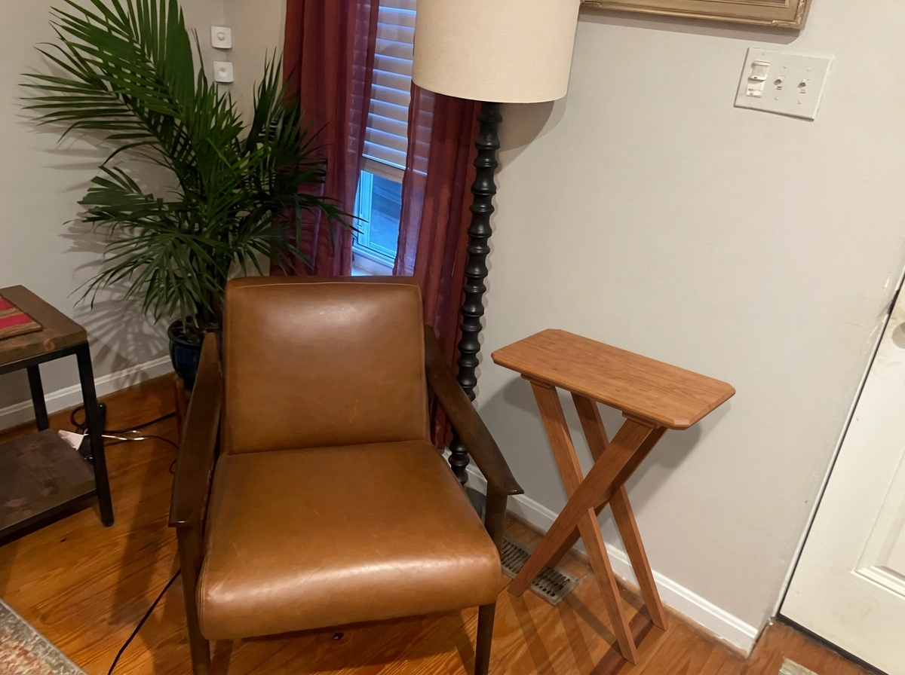

# Cherry X-Leg End Table

A custom solid-cherry end table, designed parametrically in FreeCAD to sit beside
the leather armchair in `reference/chair.jpeg`.

**Overall: 20" L × 8¼" W × 24" H** — a thin floating top with a chamfered
underside edge over two crossed (X) tapered legs joined by half-laps, tied
together at the bottom by a central stretcher and at the top by two cleats (which
also attach the top with figure-8 fasteners for wood movement). Full dimensions and the build sequence are in
[`docs/plans.html`](docs/plans.html); the design brief is in
[`docs/END_TABLE_SPECS.md`](docs/END_TABLE_SPECS.md).



## Project layout

```
end_table/
├── CLAUDE.md                 project instructions (build commands, layout)
├── README.md                 this file
├── docs/
│   ├── END_TABLE_SPECS.md    design brief / locked dimensions
│   ├── plans.html            printable build plans (cut list, joinery, steps)
│   └── diagrams/             generated SVG shop drawings (embedded in plans.html)
├── scripts/
│   ├── build_end_table.py    parametric model generator (FreeCAD)
│   ├── preview_end_table.py  orthographic CAD preview (matplotlib)
│   ├── draw_diagrams.py      dimensioned shop drawings (matplotlib → docs/diagrams)
│   └── gemini_render.py      photoreal render beside the chair (Gemini, on request)
├── model/                    generated CAD: end_table.FCStd (+ .stl mesh)
├── renders/                  generated images (previews + composite)
└── reference/                input assets: chair.jpeg
```

## Building the model

All commands run from the project root.

**1. Generate the CAD model** (writes `model/end_table.FCStd` + `.stl`):
```
"C:\Program Files\FreeCAD 1.1\bin\freecadcmd.exe" scripts\build_end_table.py
```
Edit the parameter block at the top of `scripts/build_end_table.py` to change any
dimension, then re-run.

**2. Render the CAD preview** (writes `renders/end_table_preview.png`):
```
python scripts\preview_end_table.py
```

**3. Generate the shop drawings** (writes dimensioned SVGs to `docs/diagrams/`,
embedded in `plans.html`):
```
python scripts\draw_diagrams.py
```

**4. Photoreal render beside the chair** (optional; writes
`renders/table_with_chair_realistic.png`):
```
python scripts\gemini_render.py
```
Requires `GEMINI_API_KEY` in the environment, `pip install google-genai`, and
billing enabled on the Google project.

## Requirements

- FreeCAD 1.1 (headless `freecadcmd`)
- Python 3 with `numpy`, `matplotlib`, `Pillow` (and `google-genai` for the
  Gemini render)
